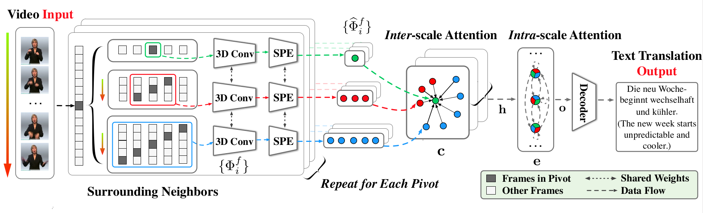

# TSPNet

**[TSPNet: Hierarchical Feature Learning via Temporal Semantic Pyramid for Sign Language Translation](https://proceedings.neurips.cc//paper/2020/file/8c00dee24c9878fea090ed070b44f1ab-Paper.pdf)**

By [Dongxu Li](https://scholar.google.com.au/citations?user=h5XtaUUAAAAJ&hl=en&oi=ao)&ast;, [Chenchen Xu](https://scholar.google.com.au/citations?user=01_mhZcAAAAJ&hl=en)&ast;,  [Xin Yu](https://scholar.google.com.au/citations?user=oxdtuSEAAAAJ&hl=en), [Kaihao Zhang](https://scholar.google.com.au/citations?user=eqwDXdMAAAAJ&hl=en), [Benjamin Swift](https://scholar.google.com.au/citations?user=OQdYgLEAAAAJ&hl=en), [Hanna Suominen](https://scholar.google.com.au/citations?user=o4qymo4AAAAJ&hl=en) and [Hongdong Li](https://scholar.google.com.au/citations?user=Mq89JAcAAAAJ&hl=en)

(&ast; Authors contributed equally.)



The repository contains the implementation of TSPNet. Preprocessed dataset, video features and the inference results are available at [Google Drive](https://drive.google.com/drive/folders/1oYV_k1wqGbPUhBrkLRMQb1iWKQp5P3pp?usp=sharing).

We thank authors of [fairseq](https://github.com/pytorch/fairseq) for their efforts.

### Rquirements

* [PyTorch](http://pytorch.org/) version >= 1.4.0
* Python version >= 3.6
* For training new models, you'll also need NVIDIA GPU and (optionally) [NCCL](https://github.com/NVIDIA/nccl)
* (optional) [BPEMB](https://nlp.h-its.org/bpemb/), if you prepare datasets by yourself (see below)

### Install from source

Install the project from source and develop locally:

```bash
cd fairseq
pip install --editable .
```

### Getting started

#### Preprocessing

Download the [preprocessed dataset](https://drive.google.com/drive/folders/1oYV_k1wqGbPUhBrkLRMQb1iWKQp5P3pp?usp=sharing), and arrange them as:

```
TSPNet/
├── i3d-features/
│   ├── span=8_stride=2
│   ├── span=12_stride=2
│   └── span=16_stride=2
├── data-bin/
│   └── phoenix2014T/
│       └── sp25000/
│   
├── README.md
├── run-scripts/
└── test-scripts/
```

* **i3d-features**: the i3d output features of input videos
* **data-bin**: the preprocessed translation texts


#### Training

Go to the `run_scripts` folder and start training:

```bash
cd TSPNet/run_scripts
SAVE_DIR=CHECKPOINT_PATH bash run_phoenix_pos_embed_sp_test_3lvl.sh
```

<!---The script replicates performance in the paper. --->

#### Testing
After training, you can make inference on the testing dataset by specifying a checkpoint file.

<!---To validate the model on the testing test, run the testing script with the checkpoints saved from the training step.--->
**Note**, `CHECKPOINT_FILE_PATH` points to a saved checkpoint file, rather the `CHECKPOINT` folder.

```bash
CHECKPOINT=CHECKPOINT_FILE_PATH bash test_phoenix_pos_embed_sp_test_3lvl.sh
```

The script reports multiple metrics, including the ROUGE-L and BLEU-{n} as reported in the paper.


#### Alternative instructions for preparing datasets by yourself

1. **Text**

Install German word embeddings [BPEMB](https://nlp.h-its.org/bpemb/) by `pip install bpemb`.

Preprocess the translation texts using `preprocess_sign.py` to BPE, repeatedly for each split, for example:

```bash
python preprocess_sign.py --save-vecs data/processed/emb data/ori/phoenix2014T.train.de data/processed/train.de

python preprocess_sign.py data/ori/phoenix2014T.test.de data/processed/test.de
```

2. **Vocabulary**

<!---Run `fairseq-preprocess` to generate the dictionary file. It is optional to drop `--dataset-impl raw` to generate binarized dataset. Without invoking binarization, the only thing we need from this step is the vocabulary (dictionary) file `dict.de.txt`.--->


Generate the dictionary file `dict.de.txt`.

```bash
fairseq-preprocess --source-lang de --target-lang de --trainpref data/processed/train --testpref data/processed/test --destdir data-bin/ --dataset-impl raw
```

3. **Video** Prepare sign videos and the corresponding video features (e.g. by pretrained i3d networks), and create a json file for each split (e.g. train.sign-de.sign). The json file should be of the format below. It should have the same number of entries as the text file, where each entry corresponds to the sentence at the same line no in the prepared text file.

```json
[
    {
        "ident": "VIDEO_ID",
        "size": "64  // length of video features"
    },
    "..."
]

```


4. Finally, arrange text files, video json files, word embeddings and vocabulary files into a folder as below:

```
data-bin/
├── train.sign-de.sign
├── train.sign-de.de
│
├── test.sign-de.sign
├── test.sign-de.de
│
├── emb
└── dict.de.txt
```


### Citations
Please cite our paper and [WLASL dataset](https://dxli94.github.io/WLASL/) (for pre-training) as:

``` bibtex
@inproceedings{li2020tspnet,
	title        = {TSPNet: Hierarchical Feature Learning via Temporal Semantic Pyramid for Sign Language Translation},
	author       = {Li, Dongxu and Xu, Chenchen and Yu, Xin and Zhang, Kaihao and Swift, Benjamin and Suominen, Hanna and Li, Hongdong},
	year         = 2020,
	booktitle    = {Advances in Neural Information Processing Systems},
	volume       = 33
}

@inproceedings{li2020word,
    title={Word-level Deep Sign Language Recognition from Video: A New Large-scale Dataset and Methods Comparison},
    author={Li, Dongxu and Rodriguez, Cristian and Yu, Xin and Li, Hongdong},
    booktitle={The IEEE Winter Conference on Applications of Computer Vision},
    pages={1459--1469},
    year={2020}
}
```

Other works you might be interested to look at:
```bibtex
@inproceedings{li2020transferring,
  title={Transferring cross-domain knowledge for video sign language recognition},
  author={Li, Dongxu and Yu, Xin and Xu, Chenchen and Petersson, Lars and Li, Hongdong},
  booktitle={Proceedings of the IEEE/CVF Conference on Computer Vision and Pattern Recognition},
  pages={6205--6214},
  year={2020}
}
```
